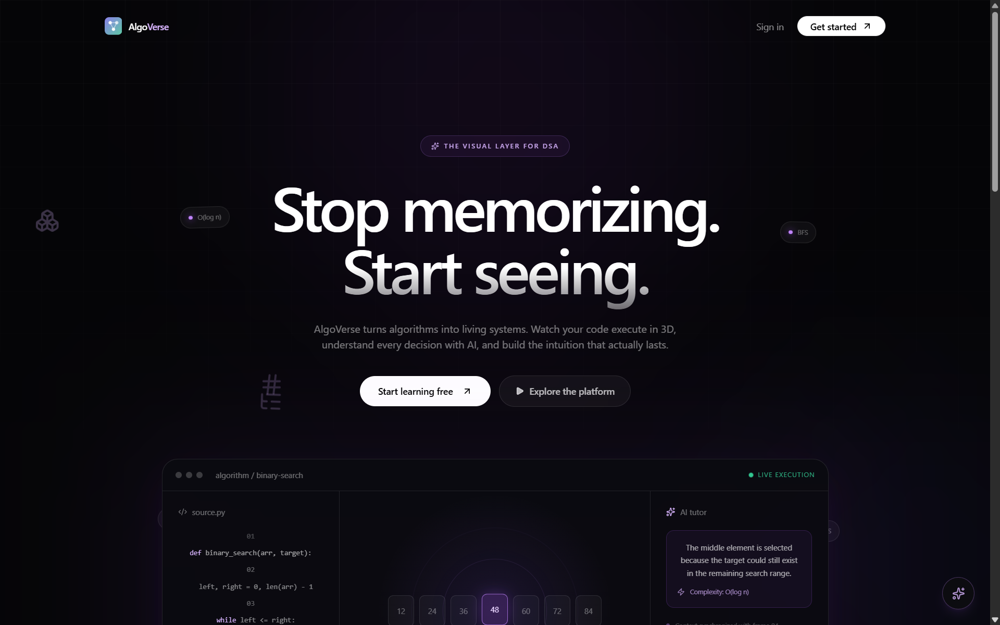
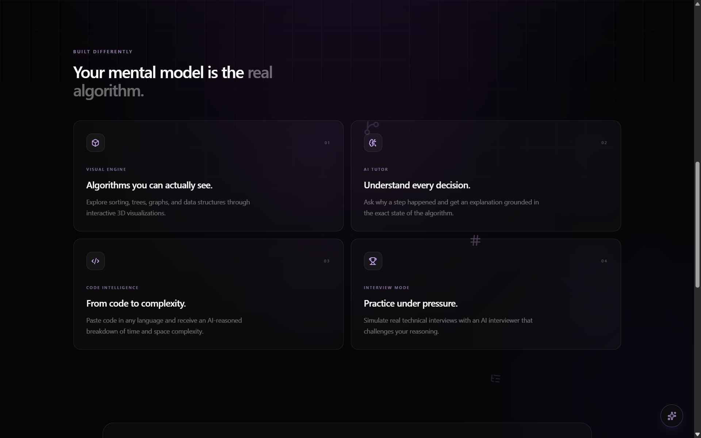
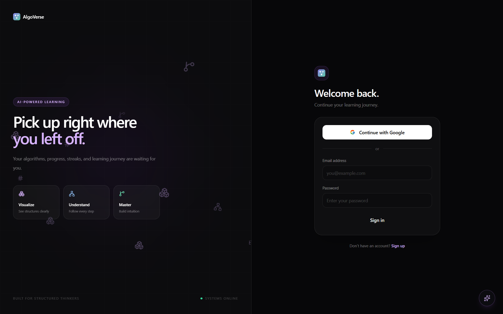
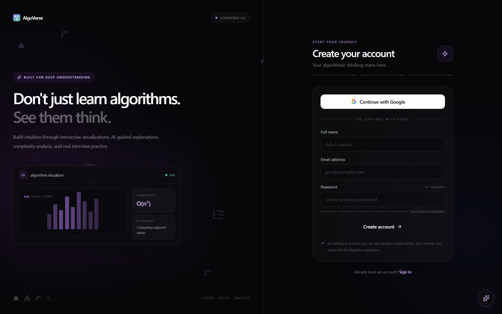
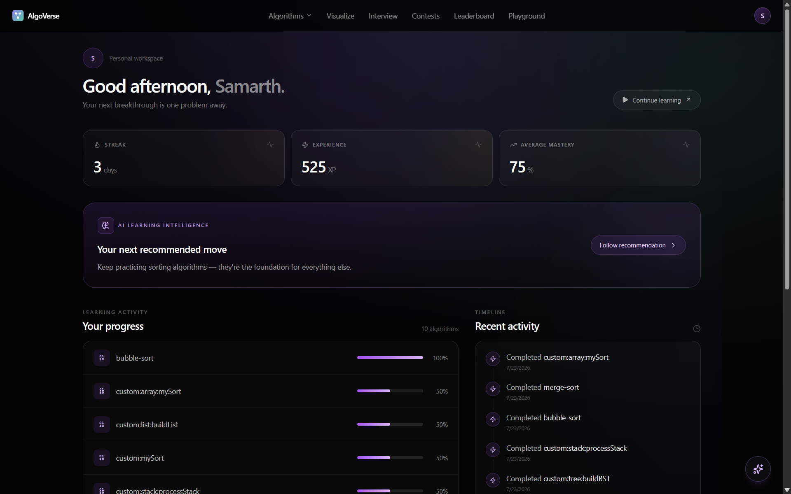
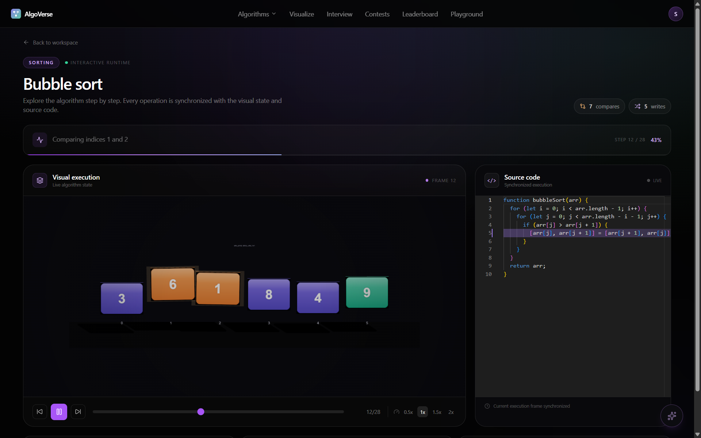
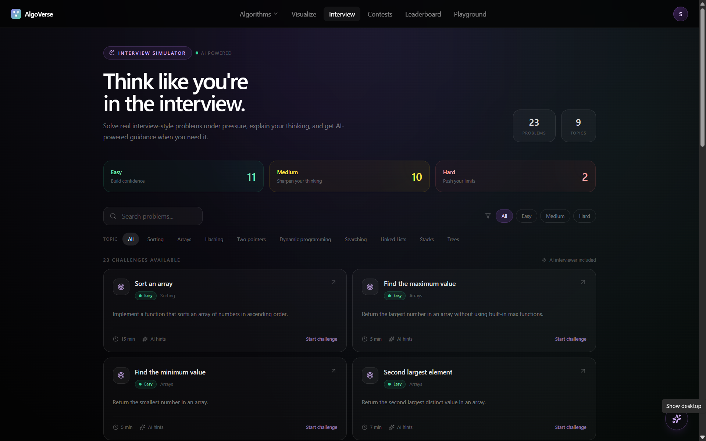
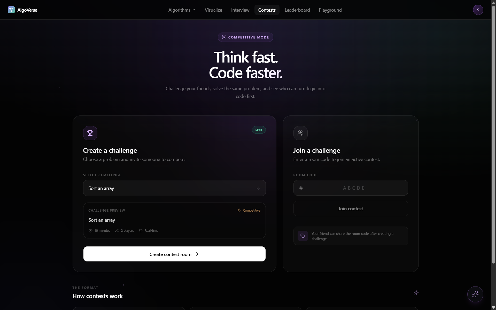
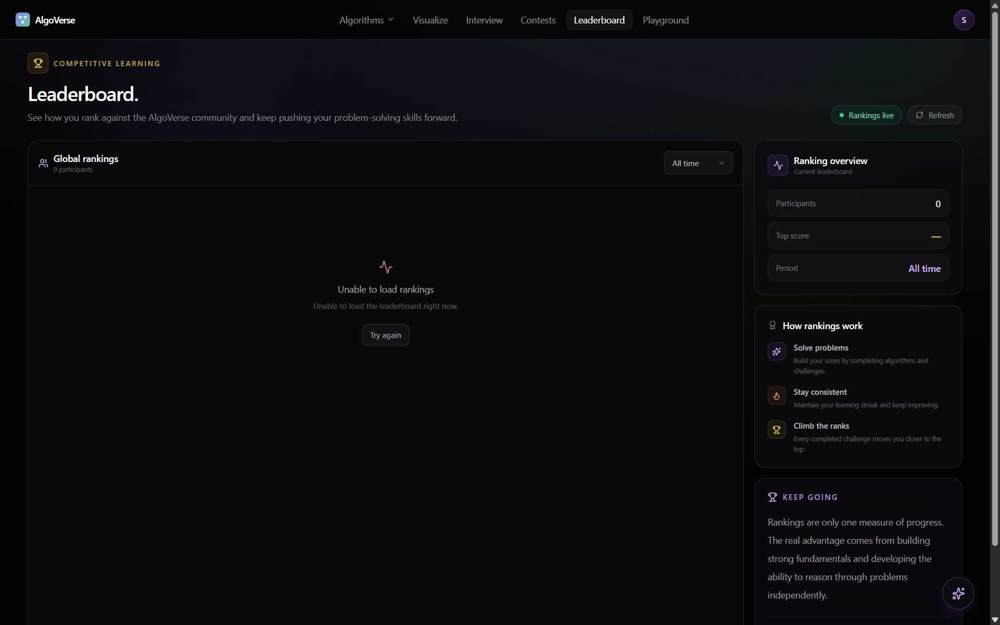

# AlgoVerse

A full-stack platform that transforms Data Structures and Algorithms into interactive 2D/3D visual experiences with AI-powered learning, interview practice, and real-time contests.

---

## Overview

AlgoVerse helps learners understand DSA by connecting algorithm execution with visual interaction.

Users can explore algorithms step by step, visualize data structure operations, write and execute code against tracked structures, practice technical interviews with an AI interviewer, analyze complexity, and compete in real-time contests.


---

---

---

---

---

---

---

---


---

## Features

### Interactive Visualizations

* Sorting algorithms with step-by-step playback
* Arrays, Linked Lists, Stacks, and Binary Search Trees
* Comparisons, swaps, insertions, and traversals visualized in real time
* Play, pause, step, and timeline scrubbing

### Visualize My Code

Write JavaScript code using supported tracked data structures and watch every mutation transform into a visual state.

### AI-Powered Learning

* Context-aware AI DSA tutor
* Algorithm explanations and hints
* AI mock interviewer with follow-up questions
* Code review and performance scorecards
* AI-generated study recommendations

### Interview Practice

Practice DSA problems across:

* Arrays
* Hashing
* Two Pointers
* Searching
* Dynamic Programming
* Linked Lists
* Stacks
* Trees

### Real-Time Contests

Create or join contest rooms, solve shared problems, and compete through live Socket.io-powered leaderboards.

### Complexity Analysis

Analyze code using a hybrid approach combining:

* Gemini-based code reasoning
* JavaScript AST analysis with Acorn
* TensorFlow.js heuristic classification

### Progress Tracking

Track:

* XP
* Streaks
* Mastery
* Recent activity
* Personalized recommendations
* Topics due for review

---

## Tech Stack

| Category           | Technologies                                                   |
| ------------------ | -------------------------------------------------------------- |
| Frontend           | React, Vite, TypeScript, Tailwind CSS, shadcn/ui, React Router |
| Visualization      | Three.js, React Three Fiber                                    |
| State & Editor     | Zustand, Monaco Editor                                         |
| Backend            | Node.js, Express, TypeScript                                   |
| Database           | MongoDB, Mongoose                                              |
| Authentication     | JWT, bcrypt, Passport.js, Google OAuth                         |
| Real-Time          | Socket.io                                                      |
| AI                 | Anthropic API                                              |
| ML & Code Analysis | TensorFlow.js, Acorn                                           |

---

## Project Structure

```text
AlgoVerse/
├── client/
│   └── src/
│       ├── pages/
│       ├── components/
│       ├── engine-core/
│       │   ├── algorithms/
│       │   ├── types/
│       │   └── replay.ts
│       ├── interview/
│       ├── stores/
│       └── lib/
│
├── server/
│   └── src/
│       ├── models/
│       ├── controllers/
│       ├── routes/
│       ├── middleware/
│       ├── config/
│       ├── ml/
│       ├── sockets/
│       └── lib/
│
├── .gitignore
├── docs/
└── README.md
```

---

## Getting Started

### Prerequisites

* Node.js 20+
* npm 10+
* MongoDB or MongoDB Atlas
* Google Gemini API key

### Installation

```bash
git clone https://github.com/samoff04/AlgoVerse.git
cd AlgoVerse
npm run install:all
```

### Environment Variables

Create `server/.env`:

```env
PORT=5000
MONGODB_URI=mongodb://localhost:27017/algoverse
JWT_SECRET=your-long-random-secret
CLIENT_URL=http://localhost:5173
GEMINI_API_KEY=your-gemini-api-key
```

Optional Google OAuth variables:

```env
GOOGLE_CLIENT_ID=your-google-client-id
GOOGLE_CLIENT_SECRET=your-google-client-secret
```

Create `client/.env`:

```env
VITE_API_URL=http://localhost:5000/api
```

### Run Locally

```bash
npm run dev
```

The application will be available at:

```text
http://localhost:5173
```

---

## Highlights

* Event-driven algorithm visualization engine with deterministic replay
* Reusable tracked data structures for code visualization
* Dynamic algorithm registry for extensible visualizations
* REST APIs combined with WebSocket-based real-time communication
* JWT and OAuth-based authentication
* AI-powered tutoring and technical interview systems
* Hybrid AI and heuristic-based complexity analysis
* Server-side XP, streak, progress, and leaderboard systems

---

## Author

Samarth Varshney